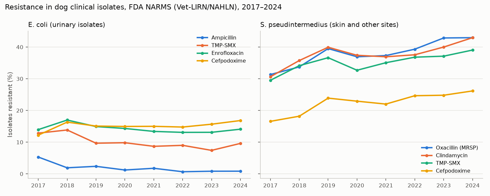

# Antimicrobial Resistance in Dog Clinical Isolates: Results

Real data: FDA NARMS Animal Pathogen AMR Data (Vet-LIRN and NAHLN laboratories), downloaded 2026-10-02. 500,268 interpretable test results on 12,958 *E. coli* and 13,438 *S. pseudintermedius* isolates from dogs, 30 states plus Canadian laboratories, 2017–2024. Spec and amendments: [`amr_spec.md`](amr_spec.md). Code: `src/tailsignal/models/amr.py`. Outputs: `reports/amr/`.

## Headlines

1. **Methicillin-resistant *S. pseudintermedius* (MRSP) is common and rising.** 36.5% of isolates overall. From skin and other sites: 31% in 2017 → 43% in 2024. From urine: 20% → 32%. Adjusted for region and site, the odds rise 7% a year (OR 1.07, 95% CI 1.05–1.09). **The pre-registered expectation (present at a meaningful level and not declining) is confirmed.**
2. ***S. pseudintermedius* is becoming harder to treat across the board.** Every one of the 16 significant rising trends is in this organism, including clindamycin (31% → 43% resistant), trimethoprim-sulfamethoxazole (30% → 39%), enrofloxacin (36% → 49%), and cefpodoxime (17% → 26%). Multidrug resistance (≥ 3 classes): 28% → 41% (OR 1.05/year, p < 0.001).
3. ***E. coli* is stable or improving.** All 7 significant falling trends are in *E. coli*. Urinary trimethoprim-sulfamethoxazole resistance fell from 13% to 10%; multidrug resistance fell from 17% to 13% (OR 0.95/year).
4. **Resistance varies by region.** MRSP runs 42% in the Northeast and 41% in the South, versus 33% in the Midwest, 30% in the West, and 20% in Canadian submissions. Southern *E. coli* urinary isolates are the least susceptible to cephalosporins and fluoroquinolones.

## What went wrong first, and how it was fixed

The pre-registered trend test pooled urine and tissue isolates. It "found" 19 rising and 10 falling trends, but several were artifacts:

| Artifact | Example | Cause |
|---|---|---|
| Site-specific breakpoints | *E. coli* amoxicillin-clavulanate: ~1% "resistant" in urine, ~100% from tissue | FDA applies a much higher susceptibility cut-off for urine, where the drug concentrates. Pooling sites turns a change in the UTI share into a fake trend. |
| Breakpoint below the wild type | *E. coli* doxycycline: 99.7% "resistant" | The label means "not suitable at this site at standard doses," not acquired resistance. |
| Selective (cascade) testing | *S. pseudintermedius* chloramphenicol 96%, marbofloxacin 98%, amikacin 3% → 32% | These drugs were tested on only a minority of isolates, mostly ones already resistant to first-line drugs. |

Breakpoints proved stable across years within each site, so the fix keeps year-on-year comparisons valid. Trends are computed within site, and only for drugs tested on ≥ 90% of isolates every year, with fewer than 95% classed resistant. That leaves 40 organism × drug × site trends (16 rising, 7 falling). Both versions are saved (`trends_pooled_prereg.csv`, `trends.csv`).

One consequence: oxacillin was tested on 89.8% of *S. pseudintermedius* isolates in 2017, just under the 90% rule, so it drops out of the general trend table. MRSP is covered by its own pre-registered analysis, which uses every oxacillin result.

## Product sample: regional urinary antibiogram for clinics

*E. coli* from dog urine, 2022–2024, percent **susceptible** (cells with < 30 isolates not reported, per CLSI M39):

| Drug | Canada | Midwest | Northeast | South | West |
|---|---|---|---|---|---|
| Amoxicillin-clavulanate | 100% | 100% | 97% | 100% | 100% |
| Ampicillin | 100% | 100% | 88% | 100% | 100% |
| Trimethoprim-sulfamethoxazole | 93% | 91% | 91% | 91% | 95% |
| Enrofloxacin | 95% | 88% | 87% | 83% | 91% |
| Marbofloxacin | 94% | 88% | 83% | 82% | 91% |
| Cefpodoxime | 93% | 87% | 83% | 79% | 88% |
| Cefazolin | 92% | 88% | 82% | 81% | 88% |
| Isolates (max per cell) | 108 | 1,918 | 233 | 1,443 | 267 |

How a clinic would use it: when treating a dog's urinary infection empirically while waiting for culture, the local table shows which commonly used drugs are still likely to work. Treatment choices belong with the vet and published guidance (e.g., the [ISCAID urinary guidelines](https://www.sciencedirect.com/science/article/abs/pii/S109002331830460X)).

## Adjusted regional effects (odds ratios vs. Midwest, controlling for year and site)

| Organism × drug | Northeast | South | West |
|---|---|---|---|
| *S. pseudintermedius* × clindamycin | 1.43 | 1.28 | 1.10 |
| *S. pseudintermedius* × trimethoprim-sulfamethoxazole | 1.31 | 1.32 | 0.85 |
| *E. coli* × enrofloxacin | 1.28 | 1.37 | 0.71 |
| *E. coli* × cefpodoxime | 1.28 | 1.39 | 0.86 |

*E. coli* amoxicillin-clavulanate in urine is too rarely resistant (0.2–3%) for a stable regional model; its odds ratios are not reported.

## Limits

- Isolates come from diagnostic submissions, which over-represent recurrent and hard-to-treat infections. Percentages describe submitted isolates, not all dog infections.
- Laboratory participation varies by state and year; regional differences partly reflect which labs submit.
- Interpretations are FDA's as supplied, applied consistently over time within each site.

## Commercial uses

| Product | Buyer | Monetization model |
|---|---|---|
| Regional antibiograms in the partner portal, refreshed yearly | Clinics and clinic groups | Embedded Analytics |
| MRSP and multidrug-resistance trend feed by region | Public-health agencies, One Health programs | Data Products |
| Market intelligence: which drugs are losing effectiveness, where | Antibiotic manufacturers; diagnostics companies (case for culture-and-susceptibility testing) | Research & Insights |
| Stewardship scorecards ([sample](simulator_extension_results.md), built on the EHR layer) | Clinic groups, insurers | Embedded Analytics |
