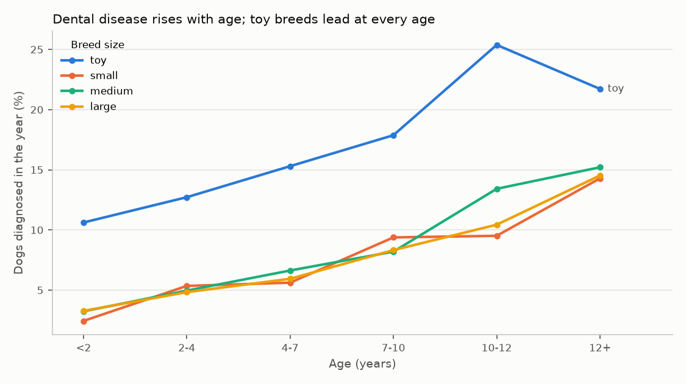

# Oral Health Insights Report

*Sample Research & Insights product for pet food, dental care, and clinic-group buyers. Built on TailSignal's simulated partner network (24,380 dog-years and 8,116 cat-years with a vet visit, 2022–2025). The numbers show the method and the product format; they are not market estimates. Code: `src/tailsignal/models/oral_health.py`. Outputs: `reports/oral_health/`.*

## Headlines

1. **About 1 in 11 dogs seen by a vet is diagnosed with dental disease each year** (9.4%, 95% CI 9.1–9.8%). Cats: 10.0%.
2. **Toy breeds carry 2.5 times the odds** of larger dogs after adjusting for age (OR 2.49, 95% CI 2.17–2.85). Yorkshire Terriers (19%), Chihuahuas (18%), and Shih Tzus (17%) top the breed list.
3. **Risk climbs steadily with age**: from 4% of dogs under 2 to 15% of dogs 12 and older (adjusted OR 2.9 vs. age 2–4).
4. **Fewer than half of diagnosed dogs get a cleaning the same year** (46%). At an average of $783 per cleaning, raising that to 60% across this network would add about 80 cleanings and roughly $63,000 a year (illustrative).

## Who is affected

| Breed size | Dog-years | Diagnosed | 95% CI |
|---|---|---|---|
| Toy | 2,293 | **17.7%** | 16.2–19.3% |
| Small | 3,125 | 8.2% | 7.3–9.2% |
| Medium | 8,248 | 9.0% | 8.4–9.6% |
| Large | 10,573 | 8.4% | 7.8–8.9% |

| Age | <2 | 2–4 | 4–7 | 7–10 | 10–12 | 12+ |
|---|---|---|---|---|---|---|
| Diagnosed | 3.8% | 5.6% | 7.0% | 9.3% | 12.7% | 15.4% |

**Breed ranking.** Each breed's rate is shrunk toward its size class (beta-binomial empirical Bayes), so small breeds with few records do not top the list by chance. Breeds with at least 30 dog-years:

| Breed | Size | Dog-years | Raw | Shrunk estimate (90% interval) |
|---|---|---|---|---|
| Yorkshire Terrier | toy | 790 | 20.1% | **19.0%** (17.3–20.7) |
| Chihuahua | toy | 618 | 17.8% | **17.7%** (16.1–19.5) |
| Shih Tzu | toy | 885 | 15.5% | **16.5%** (15.0–18.0) |
| Poodle | medium | 1,265 | 11.9% | 10.9% (9.8–12.1) |
| Dachshund | small | 1,011 | 10.0% | 9.4% (8.2–10.6) |

## Commercial uses

| Buyer | Use |
|---|---|
| Dental chew, diet, and oral-care brands | Target toy breeds from early adulthood; size the addressable population by breed, age, and region (`product_dental_prevalence.csv`, suppressed below 10 pets per cell) |
| Clinic groups | Close the treatment gap: diagnosed dogs without a cleaning are a ready list for recall reminders |
| Clinic groups and PE due diligence | Observed vs. expected diagnosis rates per clinic (funnel plot). All 9 simulated clinics fall within the expected range, which is the right answer here: the simulator gives clinics no differences in diagnostic thoroughness, so the method correctly flags none |

## How this compares with published research

| | TailSignal (simulated) | Banfield / Waltham (US) | VetCompass (UK) |
|---|---|---|---|
| Population | 24,380 dog-years | 3M+ records, 60 breeds, 5 years | 22,333 dogs, 1 year |
| Overall | 9.4% per year | 18.2% (5-year period prevalence) | 12.5% per year |
| Smallest vs. large breeds | Toy 2.1× large | Extra-small 1.9× large (22.4% vs. 11.9%); extra-small up to 5× giant | Under 10 kg: 3.07× risk vs. 30–40 kg |
| Small (non-toy) breeds | Same as large | **Highest** (25.7%) | Elevated |
| Oldest vs. young adults | 12+ vs. 2–4: 2.7× | Odds rise steadily with age | 12+ vs. 2–4: 3.91× |
| Overweight | No effect (OR 0.94, n.s.) | **OR 1.65–2.23** | — |
| Top breeds | Yorkie, Chihuahua, Shih Tzu | Greyhound, Shetland Sheepdog, Papillon, Toy and Miniature Poodle | Toy Poodle, King Charles Spaniel, Greyhound, Cavalier |

The age pattern and the toy-breed excess match the literature. **Four gaps show where the simulator falls short of real practice**, and they go straight into the simulator extension (roadmap option 3):

1. **Small breeds.** Published studies find small breeds (not just toy) at the highest risk; the simulator raises risk only for toy breeds and a few named breeds.
2. **Overweight dogs.** Both are simulated, but the simulator does not link them; real data show 1.7–2.2× odds.
3. **Detection at wellness exams.** Here, dogs *without* a wellness exam that year are more often diagnosed (20.8% vs. 8.0%), because their only visit was a sick visit. In real practice periodontal disease is mostly found and graded at routine exams, so exams should *raise* recorded prevalence. The simulator needs a "detected at wellness exam" step.
4. **Clinic differences.** Real clinics differ in how thoroughly they chart dental disease; without that variation, clinic benchmarks have nothing to find.

## Methods

- **Unit:** pet-year. Denominator: pets with any vet visit in the calendar year. Case: any visit that year with a dental-disease diagnosis or procedure. Cleaning: a dental visit of $400 or more (matches "dental cleaning under anesthesia" line items exactly where line items exist).
- **Size class:** from the breed taxonomy (`dbt/seeds/breed_aliases.csv`).
- **Adjusted odds ratios:** logistic regression on size, age band, obesity history, wellness exam, and market, with standard errors clustered by pet.
- **Breed shrinkage:** beta-binomial prior per size class, strength estimated by method of moments.
- **Clinic benchmark:** observed vs. model-expected cases per clinic, with Poisson funnel limits at 95% and 99.8%.
- **Privacy:** the product table suppresses any cell with fewer than 10 pets or 1–9 cases.

## Sources

- Wallis C. et al. (2021). [Association of periodontal disease with breed size, breed, weight, and age in pure-bred client-owned dogs in the United States](https://www.sciencedirect.com/science/article/pii/S109002332100112X). *The Veterinary Journal*.
- O'Neill D.G. et al. (2021). [Epidemiology of periodontal disease in dogs in the UK primary-care veterinary setting](https://onlinelibrary.wiley.com/doi/10.1111/jsap.13405). *Journal of Small Animal Practice*; [RVC summary](https://www.rvc.ac.uk/vetcompass/news/new-rvc-research-gets-to-the-root-of-dental-disease-in-dogs).
- [Data-driven pet insights gleaned from 150 million pet visits](https://todaysveterinarypractice.com/news/data-driven-pet-insights-gleaned-from-150-million-pet-visits/). *Today's Veterinary Practice*.
