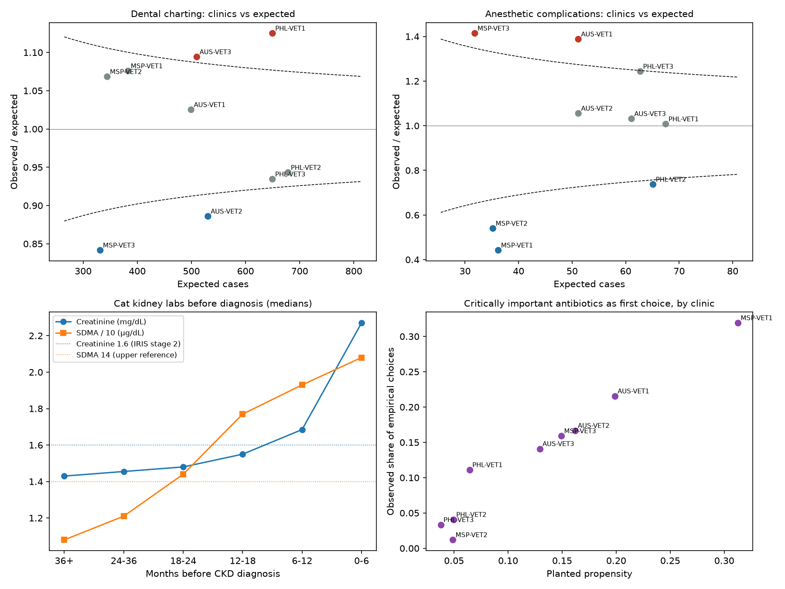

# Simulator Extension: Clinical EHR Layer — Results

The EHR layer adds what sits inside a clinic's records: prescriptions, procedures and anesthesia, lab panels, culture results built from real FDA NARMS isolates, clinical notes, and microchip numbers. It re-creates the platform world from the same seed, so every earlier result is unchanged. Spec, planted parameters, and amendments: [`simulator_extension_spec.md`](simulator_extension_spec.md). Code: `src/tailsignal/synth/ehr.py`, `ehr_notes.py`, `ehr_validate.py`. Outputs: `data/raw/ehr/`, `data/truth/ehr/`, `reports/ehr_validation/`.

## What was built

| Table | Rows | Contents |
|---|---|---|
| Visits | 61,527 | Visit type, diagnosis, weight, body condition score, dental grade when charted |
| Prescriptions | 47,635 | Flea/tick (isoxazoline vs other), heartworm, NSAIDs, antibiotics with culture and first-line flags |
| Procedures | 4,995 | Dental cleanings, spay/neuter, mass removal, cruciate repair, IVDD surgery; ASA class, complications, 12 deaths |
| Lab results | 99,687 | Creatinine, BUN, SDMA, urine specific gravity, urine protein:creatinine, urine pH, WBC |
| Culture results | 7,539 | 696 cultures; each isolate is a real NARMS dog isolate drawn by organism, site, region, and year |
| Clinical notes | 61,527 | Abbreviations, misspellings, negations, history mentions, "fit and well" |
| Patient records | 12,990 | One per pet per clinic; microchip captured unevenly, with transcription errors |

## Validation scorecard

26 of 35 checks pass. The 9 that fail are reported, not hidden: 6 are pre-registered checks that were revised for stated reasons (each revised version passes), and 3 are genuine misses.

| Area | Result | Verdict |
|---|---|---|
| Platform consistency | All 53,167 platform vet visits carried into the EHR layer; regeneration is deterministic | Pass |
| Dental | Dogs 18.1%/yr (target 12–18%); toy 32%, small 21%, large 15%; overweight OR 1.60; age 12+ vs 2–4 OR 4.7 | Prevalence **just misses** (18.1%); others pass |
| Dental: exams find disease | Among dogs with grade ≥ 2 disease, 76% recorded in years with a wellness exam vs. 61% without. Raw prevalence is *not* higher with an exam (17.7% vs 20.2%) because exam-free years are sick-visit years | Mechanism passes; raw check **fails** |
| Dental: clinic funnel | Both planted under-charting clinics flagged low; planted thorough clinic flagged high; rank correlation with planted thoroughness 0.69 (revised target 0.7) | Pass on flags; **correlation just misses** |
| Anesthesia deaths | 12 deaths in 4,995 procedures; every species × ASA rate is consistent with CEPSAF | Pass |
| Anesthesia complications | Funnel flags the planted high (AUS-VET1) and low (MSP-VET1) clinics; all flags point the right way; rank correlation 0.97 | Pass |
| Kidney | Creatinine and SDMA rise and urine specific gravity falls over the 24 months before diagnosis; SDMA passes 14 about a year before creatinine passes 1.6 (median trajectory) | Pass |
| Drug-safety estimator | Over 200 re-draws, the restricted isoxazoline estimate averages RR 1.61 (planted 1.5); exact 95% CIs cover the truth at least 98% of the time in all three cohorts | Pass |
| Antibiotic cultures | First-visit cultures match NARMS regional resistance (40 of 42 cells consistent) | Pass |
| Stewardship | Observed clinic behavior ranks clinics like the planted propensities (Spearman 0.78–0.98) | Pass |

## Findings

**1. A naive drug-safety comparison gets the answer backwards.** Dogs with epilepsy are steered away from isoxazolines because the label warns about seizures. Compared naively, isoxazoline users look *protected*: RR 0.33 (95% CI 0.18–0.60). Excluding dogs with a seizure on record before the prescription, as Davies et al. (2025) do, gives RR 0.91 (0.37–2.26), consistent with the planted 1.5. Across 200 re-draws, the naive analysis averages 0.36 and the restricted one 1.61.

**2. This network is far too small to confirm a 1.5× seizure risk.** With 12,565 isoxazoline dispensings, power is 1%. Reaching 80% needs about 23 times this network (~290,000 exposed dispensings). The NSAID comparison needs about 17 times. The MDR1 negative control averages fewer than 4 events. This is the commercial argument for recruiting partner clinics: signal validation studies only become saleable at scale.

**3. Clinic death rates cannot be benchmarked; complication rates can.** Each clinic averages about 555 anesthetics and 1.3 expected deaths over four years. A clinic with double the death risk would be detected 13% of the time; reliable detection needs about 4,750 procedures per clinic. Complications are frequent enough (9%), and the funnel found both planted outlier clinics. Anesthesia benchmarks for clinic groups and due diligence should therefore score complications and pool deaths across groups of clinics.

**4. Cultures from treatment failures overstate resistance.** Methicillin resistance is 41% in first-visit *S. pseudintermedius* cultures but 64% in cultures taken after a failed treatment; *E. coli* enrofloxacin resistance is 15% vs 24%. An antibiogram built from all clinic cultures would make resistance look worse than it is. The product rule: build clinic antibiograms from first-visit cultures, or flag the mix.

**5. A stewardship scorecard is feasible from routine records.** Per clinic: culture before treatment (UTI 18–72%), first-line choice (57–83%), critically important antibiotics as first choice (1–32%), topical-only pyoderma treatment, metronidazole for acute diarrhea, and antibiotics with dental cleanings. Treatment failed in 57% of cases when the empirical drug did not cover the isolate, vs. 11% when it did. Sample: `reports/ehr_validation/stewardship_scorecard.csv`.

**6. Keyword search of clinical notes is unusable without negation handling.** Searching for seizure terms flags 13,929 notes with 3.7% precision, mostly from "no seizures", "hx sz", and "fit and well". A negation- and history-aware rule raises precision to 73% while keeping 97% recall. This matches the paper's case for curated outcome dictionaries.

**7. Microchips link only a third of clinic switches.** Of 902 pets seen at two or more clinics, 32% can be linked by an identical microchip number in both records (chips missing, not recorded, or mistyped). Probabilistic linkage remains necessary.

**8. The kidney simulation has a realistic weakness.** At the median, SDMA leads creatinine by about a year (Hall et al. 2014 report a 17-month mean). For individual cats the lead is only 1.6 months on average, because 19% of single panels from cats that never develop CKD already exceed creatinine 1.6. A single high value is weak evidence. This favors models that use two time points and trends, as RenalTech does, and is a design input for option 6.

## Limits

- Effect sizes marked "assumption" in the spec demonstrate methods; they are not clinical estimates.
- Dental parameters were calibrated over three runs to match published targets (listed in the spec amendment). Anesthesia, kidney, drug-safety, and stewardship parameters were not tuned.
- UTI, pyoderma, and adverse-event visits exist only in the EHR layer; the platform's partner exports were left unchanged so earlier results stay reproducible.
- NARMS isolates come from diagnostic submissions and over-represent hard-to-treat infections, so simulated failure rates are pessimistic. Cats use dog isolate profiles.

## What this unlocks

| Next | Uses |
|---|---|
| Option 4: Model A2 EHR drug-safety cohorts | Prescriptions, notes with labels, the channeling confounder, microchip vs. probabilistic follow-up |
| Option 5: clinic quality benchmarks | Procedures, ASA, complications, dental charting, stewardship scorecards |
| Option 6: feline CKD prediction | Repeated lab panels with latent decline and future cases beyond the window |

## Sources

- Brodbelt D.C. et al. (2008). [The risk of death: the Confidential Enquiry into Perioperative Small Animal Fatalities](https://www.research.ed.ac.uk/en/publications/the-risk-of-death-the-confidential-enquiry-into-perioperative-sma/). *Veterinary Anaesthesia and Analgesia*.
- Hall J.A. et al. (2014), as summarized in [Early diagnosis of chronic kidney disease in dogs and cats](https://todaysveterinarypractice.com/urology-renal-medicine/early-diagnosis-of-chronic-kidney-disease-in-dogs-cats-use-of-serum-creatinine-symmetric-dimethylarginine/), *Today's Veterinary Practice*: SDMA > 14 µg/dL a mean of 17 months (range 1.5–48) before creatinine in 17 of 21 cats.
- IRIS CKD staging thresholds ([summary](https://www.radanalyzer.com/blog/iris-ckd-staging-guide-cats/)).
- Davies H. et al. (2025). Developing electronic health records as a source of real-world data for veterinary pharmacoepidemiology. *Frontiers in Veterinary Science* 12:1550468.
- Wallis C. et al. (2021); O'Neill D.G. et al. (2021); FDA NARMS: see the [oral health report](oral_health_report.md) and [AMR results](amr_results.md).
